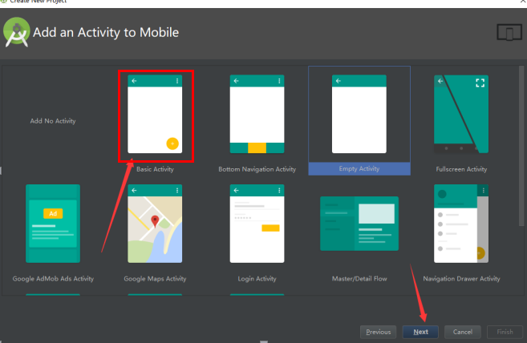

# Android Studio 安装教程

作者：畫筆爲你勾勒冷眸
链接：https://www.jianshu.com/p/de318c8a0fc6
来源：简书
著作权归作者所有。商业转载请联系作者获得授权，非商业转载请注明出处。

首先要有 安装包文章最后有连接

找到一个有10g左右空间的磁盘（不要小于10G）,首先建立一个文件夹起名叫Android，然后在此文件夹下创建两个文件夹分别起名叫AndroidStudio 和 AndroidSDK。注意所有关于AndroidStudio的安装目录不能包含中文和特殊字符！

双击打开androidstudio_2.3.3.0.exe进行安装。

分别选择刚才创建的两个文件夹进行安装，点击Next进行安装。

如果出现一个选择的界面，选择第二个 Idon’t什么什么

等待加载完成

取消

.

到这算安装完成下面进行测试 是否成功

安装完成后运行AndroidStudio 第一次可能有些慢耐心等待

启动成功
.

耐心等待

.

安装成功
出现这种页面就是安装成功！！！！恭喜渡劫！！！

链接：https://pan.baidu.com/s/1hLoJHobbP84mZ84RNUto5g
提取码：k7dz

本连接下载内容请不要用于商业用途，仅供学习使用