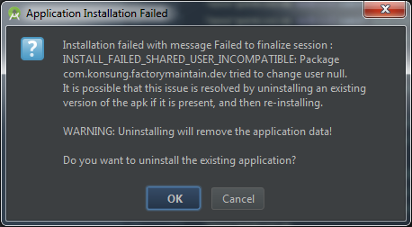
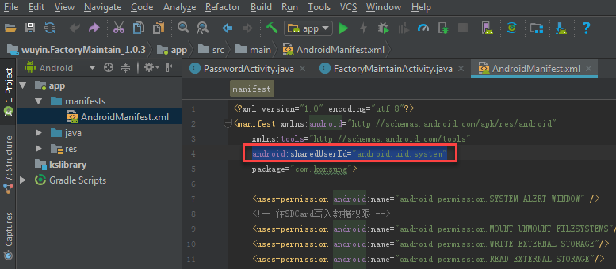

## 连接华为手机
* 下载安装：[华为手机助手(HiSuite)](https://consumer.huawei.com/cn/support/hisuite/)
* 在手机设置里允许HDB
* 进入手机的“设置”，找到“关于手机”，持续点击“版本号”就可以打开开发者模式
* 回到手机“设置”，进入”开发者选项“，打开里面的“USB调试”
* 在android studio中菜单栏“Tool”,点击后鼠标指到”Android“，点击其中的"Android Device Monitor"，查看是否已连接上。

## 命令行编译工程
在命令行运行工程目录下的“gradlew.bat”

### 第一个错误
> $ ./gradlew.bat
> FAILURE: Build failed with an exception.
> What went wrong:
> Could not determine java version from '11.0.1'.

更新文件：
PROJECT_PATH/android/gradle/wrapper/gradle-wrapper.properties
中的
distributionUrl=https\://services.gradle.org/distributions/`gradle-5.0-all.zip`

## 安卓基本概念
### View（视图）
Android的图形用户界面由多个视图（View）和视图组（ViewGroup）构建而成。
* `View`[控件]：是通用的 UI 窗体小组件，如：按钮（Button）、文本框（Text field）；
* `ViewGroup`[控件容器]：则是用来定义子视图布局的不可见的容器，如：网格部件（grid）、垂直列表部件（vertical list）。

### Intent
`Intent`是指在相互独立的组件（如两个 Activity）之间提供运行时绑定功能的对象。Intent 表示一个应用“执行某项操作的意向”。

## FAQ
### 在手机上运行一体机的程序，报错
INSTALL_FAILED_SHARED_USER_INCOMPATIBLE

原因是目标手机里的签名文件跟APK文件里的不匹配。
解决办法是删掉文件Androidmanifest.xml中的SharedUserID这个属性：
~~~ xml
<manifest xmlns:android="http://schemas.android.com/apk/res/android"
    package="com.android.sety"
    android:sharedUserId="android.uid.system">
~~~
