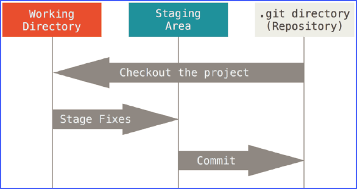
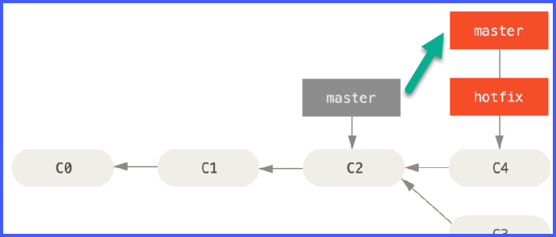
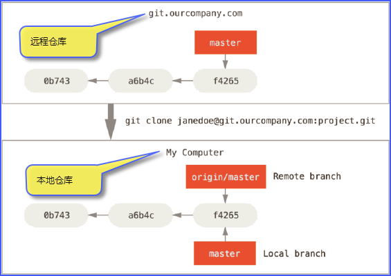
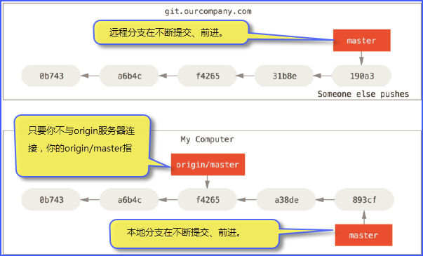
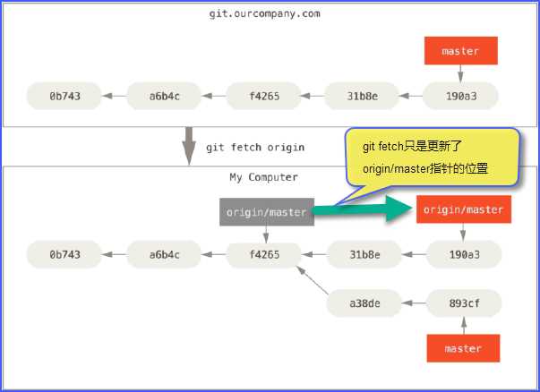

# git笔记

## 使用GitHub

参考了[廖雪峰的Git教程](https://www.liaoxuefeng.com/wiki/0013739516305929606dd18361248578c67b8067c8c017b000)。
每次更换了电脑后都要重复这个步骤，否则每次push修改的时候要输入用户名和密码。
* 第1步：在本机创建SSH Key。
~~~ bash
$ ssh-keygen -t rsa -C "youremail@example.com"
~~~
你需要把邮件地址换成你自己的邮件地址，然后一路回车，使用默认值即可。
如果一切顺利的话，可以在用户主目录（`C:\Users\Wu Yin`）里找到.ssh目录，里面有`id_rsa`和`id_rsa.pub`两个文件，这两个就是SSH Key的秘钥对，`id_rsa`是私钥，不能泄露出去，`id_rsa.pub`是公钥，可以放心地告诉任何人。
* 第2步：
登陆GitHub，打开“Account settings”，“SSH Keys”页面：
然后，点“Add SSH Key”，填上任意Title，在Key文本框里粘贴id_rsa.pub文件的内容：

点`Add Key`，你就应该看到已经添加的Key：

为什么GitHub需要SSH Key呢？因为GitHub需要识别出你推送的提交确实是你推送的，而不是别人冒充的，而Git支持SSH协议，所以，GitHub只要知道了你的公钥，就可以确认只有你自己才能推送。
当然，GitHub允许你添加多个Key。假定你有若干电脑，你一会儿在公司提交，一会儿在家里提交，只要把每台电脑的Key都添加到GitHub，就可以在每台电脑上往GitHub推送了。

## 基本概念
* **HEAD指针**
git有一个名为HEAD的特殊指针，它和许多其它版本控制系统（如svn或CVS）里的HEAD概念完全不同。 在git中，它是一个指针，指向当前所在的本地分支（将HEAD想象为**当前分支的别名**）。
* **三种状态**（committed、modified、staged）
你的文件可能处于其中之一：已提交（committed）、已修改（modified）和已暂存（staged）。
已提交：数据已经安全的保存在本地数据库中。
已修改：表示修改了文件，但还没保存到数据库中。
已暂存：表示对一个已修改文件的当前版本做了标记，使之包含在下次提交的快照中。
由此引入 Git 项目的三个工作区域的概念：Git 仓库、工作目录以及暂存区域。

* **fast-forward**（快进）
由于当前master分支所指向的提交是你当前提交（有关hotfix的提交）的直接上游，所以git只是简单的将指针向前移动。 换句话说，当你试图合并两个分支时，如果顺着一个分支走下去能够到达另一个分支，那么git在合并两者的时候，只会简单的将指针向前推进（指针右移），因为这种情况下的合并操作没有需要解决的分歧——这就叫做“快进（fast-forward）”。

* **origin**
“origin”是默认的远程仓库名，并无特殊含义。“master”是分支的名字。所以“origin/master”是指远程仓库上的master分支。“origin” 是当你运行git clone时默认的远程仓库名字。如果你运行`git clone -o booyah`，那么你默认的远程分支名字将会是“booyah/master”。


* **fetch**（抓取）与**pull**（拉取）
当`git fetch`命令从服务器上抓取本地没有的数据时，它并不会修改工作目录中的内容。它只会获取数据然后让你自己合并。`git pull`在大多数情况下它的含义是一个`git fetch`紧接着一个`git merge`命令。由于`git pull`的魔法经常令人困惑，所以通常单独显式地使用`fetch`与`merge`命令会更好一些。


## 常用命令
* 从GitHub远程库克隆到本地
  从任何电脑都可以克隆，GitHub的免费账号不提供私有库功能。
~~~ bash
$ git clone https://github.com/wu-yin/test.git
~~~

* 在本地建库
~~~ bash
$ git init
$ git add "files.name"
$ git commit
~~~

* 类似于`svn info`，需要用以下两个命令来实现
```bash
$ git remote -v
$ git log -1
```

* add 添加多个本地修改的文件
```bash
git add -u .  # --update  更新所有改变的文件，即提交所有变化的文件
git add -A .  # --all  提交已被修改和已被删除文件，但是不包括新的文件
```

* 删除版本库中的文件
```bash
git rm file_name
git rm -r dir_name
git rm --cached file_name  # 不删除本地文件,只从版本库中删除文件
```

* 删除untracked files
```bash
# 删除 untracked files
git clean -f

# 连 untracked 的目录也一起删掉
git clean -fd

# 连 gitignore 的untrack 文件/目录也一起删掉 （慎用）
git clean -xfd

# 在用上述 git clean 前，墙裂建议加上 -n 参数来先看看会删掉哪些文件，防止重要文件被误删
git clean -nxfd
```

* 替换默认编辑器
~~~ bash
$ git config –global core.editor notepad.exe
~~~

* 查看status的时候不显示Untracked Files
~~~ bash
$ git status -uno
~~~

* 在本地库查看远程路径
~~~ bash
$ git remote -v
~~~

* 更新代码到本地
~~~ bash
$ git pull
~~~

* 增加文件，并推送到远程
~~~ bash
$ git add file.txt
$ git commit -m "add file.txt"
$ git push origin master
~~~

* 清除本地未受控的文件
~~~ bash
$ git clean -f # 删除所有没有track过的文件。忽略.gitignore文件里的文件
$ git clean -d # 删除所有没有track过的文件夹。忽略.gitignore文件里的文件夹
$ git clean -xdf # 删除所有没有track过的文件和文件夹，不管是否在.gitignore文件里
$ git clean -n # 显示哪些文件会被删除，但不会真正的删除文件
~~~

* 修改文件后提交，并推送到远程
~~~ bash
$ git add file.txt
$ git commit -m "modify file.txt"
$ git push
~~~

* 删除版本库中的文件、文件夹
~~~ bash
$ git rm test.txt
$ git commit -m "remove test.txt"

$ git rm -r folder_path --cached  # 从版本库删除文件夹，但保留工作目录下的拷贝
$ git rm -r -f folder_path        # 从版本库和本地都删除文件夹
~~~

* 放弃某个文件的本地修改，恢复成库里的版本
~~~ bash
# 相当于SVN的revert
$ git checkout -- file.txt
$ git checkout -- dir_name
~~~

* 文件更名
~~~ bash
$ git mv filename.txt newFileName.txt
$ git commit -m "renamed filename.txt"
$ git push origin master
~~~

* 分支操作
~~~ bash
$ git branch branch.name          # 创建分支branch.name
$ git checkout branch.name      # 切换到分支branch.name

$ git checkout -b branch.name  # 创建并切换到分支branch.name上。上面两句的简写模式

$ git branch -d branch.name     # 删除分支branch.name

$ git log --graph # 以图形形式查看分支情况
~~~

* 编辑已经提交到 BASE 的日志 log
~~~ bash
$ git commit --amend
~~~

## 有关冲突
* 在A电脑修改了文件file.cpp，并push到了远程主机，随后在B电脑上也修改了同一文件file.cpp，但修改的并不是一行。此时如果B电脑push文件file.cpp到远程，会有冲突提示（在svn上不会发生，svn会自动merge）：
~~~ bash
$ git push
To github.com:wu-yin/test.git
 ! [rejected]        master -> master (non-fast-forward)
error: failed to push some refs to 'git@github.com:wu-yin/test.git'
hint: Updates were rejected because the tip of your current branch is behind
hint: its remote counterpart. Integrate the remote changes (e.g.
hint: 'git pull ...') before pushing again.
hint: See the 'Note about fast-forwards' in 'git push --help' for details.
~~~
此时需要先从远端把最新的file.cpp更新（pull）到本地，此时git才会自动merge，然后再push本地修改到远端。
