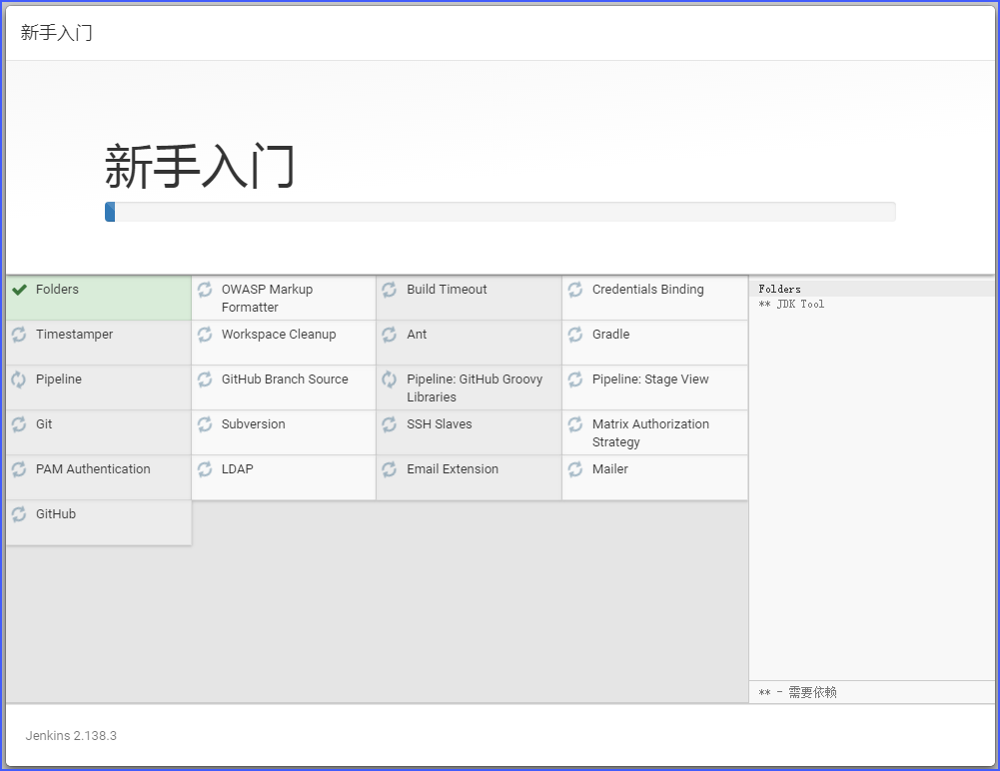
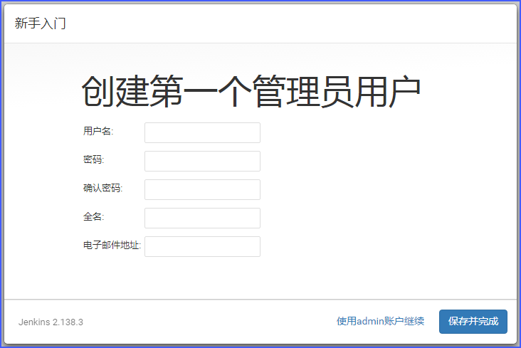
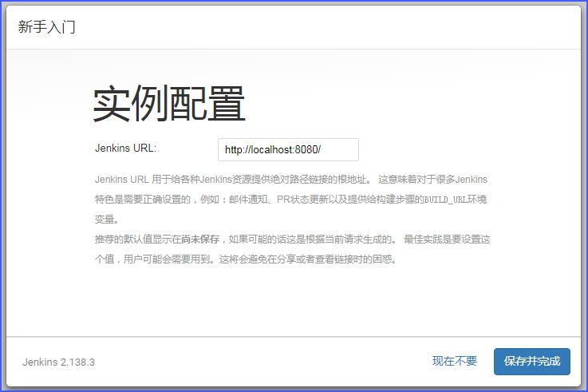

# Jenkins Learning

## 安装Jenkins(Windows)
### 安装JDK
jdk-11.0.1_windows-x64_bin.exe
添加环境变量`C:\Program Files\Java\jdk-11.0.1\bin`

### 安装git
Git-2.19.1-64-bit.exe
[~~TortoiseGit-2.7.0.0-64bit.msi~~]

### 安装Jenkins
jenkins-2.138.3.zip **>> 解压 >>** jenkins.msi
安装路径最好是`C:\Jenkins\`
安装结束后，在浏览器中输入`http://localhost:8080`，就可以看到Jenkins已经启动了。

从`C:\Jenkins\secrets\initialAdminPassword`文件中拷贝管理员的初始密码到“管理员密码”文本框中。
然后就进入到下面这个界面：

点击“选择插件来安装”：

在选择插件的界面已经默认选择了一些插件，我增加选择了GitHub的插件，然后点击“安装”，进入插件安装界面：

插件安装完后，进入了创建管理员账号的界面，我没有创建新管理员，点击了“使用admin账户继续”

继续点击“保存并完成”：

Jenkins安装完成：

进入到Jenkins主界面，安装完成：

## 问题
1. 可以使用两种方式运行Jenkins服务器：独立的应用程序，和一个标准的Web应用。Web应用是运行在Java Servlet容器里，或像Tomcat、JBoss、GlassFish等应用程序服务器。
2. 