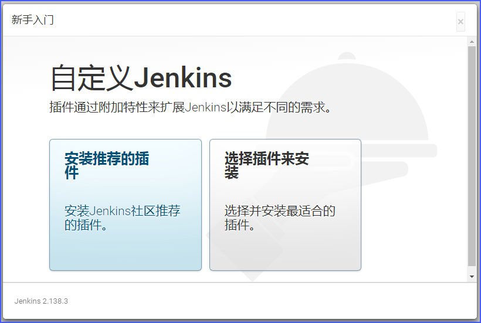
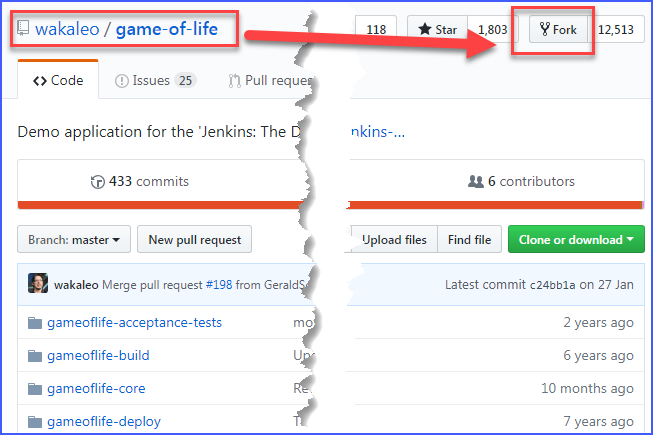

# Jenkins Learning

## 安装Jenkins(Windows)
### 安装JDK
[下载JDK](https://www.oracle.com/technetwork/java/javase/downloads/index.html)
jdk-11.0.1_windows-x64_bin.exe

* 新增环境变量`JAVA_HOME`，变量值`C:\Program Files\Java\jdk-11.0.1;`（如果最后Java环境有问题，可以试下去掉最后的”;“）
* 编辑环境变量`PATH`，添加变量值：`%JAVA_HOME%\bin;%JAVA_HOME%\jre\bin;`
* 新建`CLASSPATH`变量，变量值：`.;%JAVA_HOME%\lib;%JAVA_HOME%\lib\tools.jar;`，（注意最前面有一点）

### 安装git
Git-2.19.1-64-bit.exe
[~~TortoiseGit-2.7.0.0-64bit.msi~~]

### 安装Maven
[apache-maven-3.6.0-bin.zip](http://maven.apache.org/download.cgi)
解压后将apache-maven-3.6.0更名放在路径：`C:\apache-maven`
新建系统变量`MAVEN_HOME`，变量值：`C:\apache-maven`
编辑系统变量`Path`，添加变量值：`;%MAVEN_HOME%\bin`

### 安装Jenkins
jenkins-2.138.3.zip **>> 解压 >>** jenkins.msi
安装路径最好是`C:\Jenkins\`
安装结束后，在浏览器中输入`http://localhost:8080`，就可以看到Jenkins已经启动了。

从`C:\Jenkins\secrets\initialAdminPassword`文件中拷贝管理员的初始密码到“管理员密码”文本框中。
然后就进入到下面这个界面：

点击“选择插件来安装”：

在选择插件的界面已经默认选择了一些插件，我增加选择了GitHub的插件，然后点击“安装”，进入插件安装界面：

插件安装完后，进入了创建管理员账号的界面，我没有创建新管理员，点击了“使用admin账户继续”

继续点击“保存并完成”：

Jenkins安装完成：

进入到Jenkins主界面，安装完成：

## 创建第一个任务（job）
> 参考《Jenkins权威指南.O'REILLY》一书中第二章的构建示例。
> admin密码改成了ks123456

首先配置Java环境变量

配置Maven环境

《Jenkins权威指南.O'REILLY》书中提供了一个名为“game-of-life”的源码工程，放在GitHub上，其仓库路径为：
https://github.com/wakaleo/game-of-life
首先我们要fork这个库到我们自己账号下的库中。

在Jenkins中“新建任务”，选择“构建一个自由风格的软件项目”。

然后开始“配置任务”
其中**源码管理**中的`Repository URL`路径，好像只能写`https`开头的格式，不能写`git@`开头的格式，否则会报错。

第一次构建可能会比较久（约10分钟），因为Maven在下载一些依赖文件。

## 问题
1. 可以使用两种方式运行Jenkins服务器：独立的应用程序，和一个标准的Web应用。Web应用是运行在Java Servlet容器里，或像Tomcat、JBoss、GlassFish等应用程序服务器。
2. 