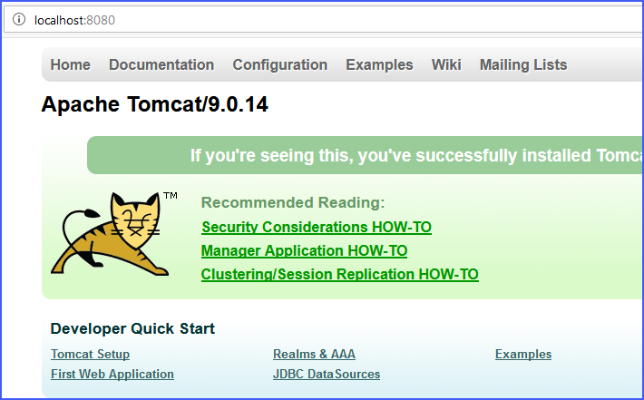
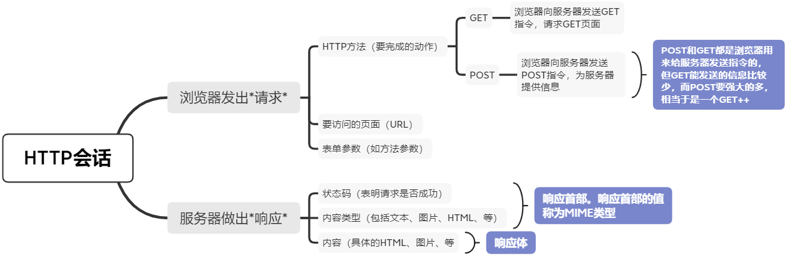
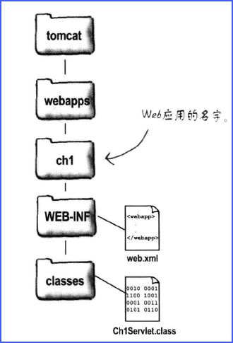
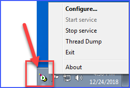
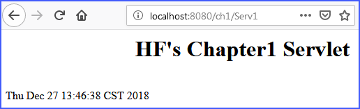
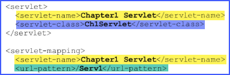
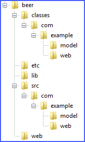
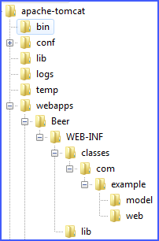
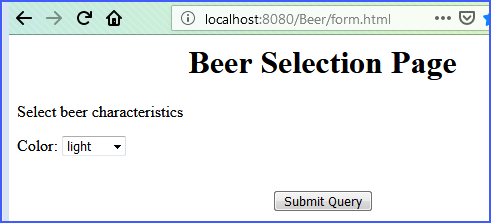
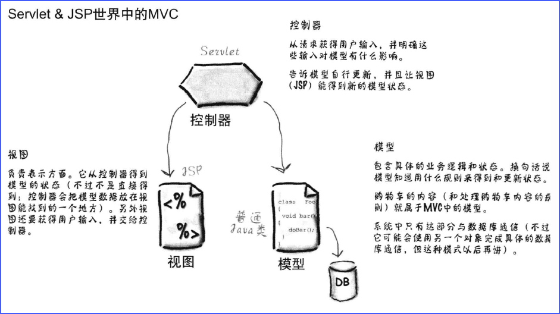

# Servlet & JSP学习笔记

[TOC]

## 安装开发环境
Windows 7、Java 11、Tomcat 9
1. 安装JDK
[下载JDK](https://www.oracle.com/technetwork/java/javase/downloads/index.html)
jdk-11.0.1_windows-x64_bin.exe
* 新增环境变量`JAVA_HOME`，变量值`C:\Program Files\Java\jdk-11.0.1;`（如果最后Java环境有问题，可以试下去掉最后的”;“）
* 编辑环境变量`PATH`，添加变量值：`%JAVA_HOME%\bin;%JAVA_HOME%\jre\bin;`
* 新建`CLASSPATH`变量，变量值：`.;%JAVA_HOME%\lib;%JAVA_HOME%\lib\tools.jar;`，（注意最前面有一点）

2. 安装Tomcat
    [下载Tomcat](https://tomcat.apache.org/download-90.cgi)
    双击`apache-tomcat-9.0.14.exe`安装
    新建`TOMCAT_HOME`变量，变量值：`C:\Program Files\Apache Software Foundation\Tomcat 9.0`

3. Tomcat命令行终端乱码问题

  修改文件`apache-tomcat\conf\logging.properties`

  ```bash
  java.util.logging.ConsoleHandler.encoding = UTF-8
  # 改为
  java.util.logging.ConsoleHandler.encoding = GBK
  ```

  

路径：http://localhost:8080/examples/ 下有很多JSP和Servlet的示例。

http://localhost:8080/
http://127.0.0.1:8080/



## 相关概念
* URL：Uniform Resource Locators（统一资源定位器）。这个字符串是大小写敏感的。
* Apache 和 Tomcat：Apache是web服务器（静态解析），Tomcat是Web应用服务器（动态解析）。
* Apache是**Web服务器应用**，Tomcat是**Web容器应用**
* Tomcat是个Web应用的容器，其中管理着很多的Servlet。Servlet没有main()方法，它们都受控于这个容器。
* 理论上，可以抛弃Servlet和Web应用容器，用纯Java来实现跟Web服务器（比如Apache）的交互。此时只有J2SE标准库可以用，需要自行实现socket连接、线程管理、JSP解析、内存管理、等等。
* Apache 和 Tomcat的同类商业软件有哪些？
* JSP 和 Servlet：JSP是代码是嵌入在HTML代码中的，用`<%  %>`括起来，当然也可以形成独立的`*.jsp`文件。
* Servlet可以用任何语言写吗？
* 一个web应用可以包含多个Servlet，但是在一个DD文件中进行描述的
* HTTP会话


## 帮助在HTML中引入Java，这就是JSP

从Java源文件中用out.println()直接输出HTML非常原始，要是有办法把Java放在HTML页面中，而不是把HTML放在Java源文件中就好了。

JSP可以做到这个要求，JSP页面就像一个HTML页面，只不过可以把Java和Java有关的东西放在这个页面中。相当于是HTML通过JSP来调用Java类。


## 实例1：第一个Servlet程序
新建一个Java源文件：Ch1Servlet.java，文件内容：

源码：Ch1Servlet.java

~~~ java
import javax.servlet.*;
import javax.servlet.http.*;
import java.io.*;

public class Ch1Servlet extends HttpServlet {
    
	public void doGet(HttpServletRequest reque,
			HttpServletResponse response)
			throws IOException {

		PrintWriter out = response.getWriter();
		java.util.Date today = new java.util.Date();
		out.println("<html>" + 
			"<body>" +
			"<h1 align=center>HF\'s Chapter1 Servlet</h1>"
			+ "<br>" + today + "</body>" + "</html>");
	}
    
}
~~~

运行cmd命令，在当前目录下打开控制台
~~~ bash
$ javac -classpath "c:\Program Files\Apache Software Foundation\Tomcat 9.0\lib\servlet-api.jar" Ch1Servlet.java
~~~
顺利的话，在该目录下会生成一个新文件`Ch1Servlet.class`
将文件`Ch1Servlet.class`拷贝到下面的文件夹中：
> C:\Program Files\Apache Software Foundation\Tomcat 9.0\webapps\ch1\WEB-INF\classes\

然后新建文件`web.xml`：
> C:\Program Files\Apache Software Foundation\Tomcat 9.0\webapps\ch1\WEB-INF\web.xml

文件`web.xml`的代码：

源码：web.xml

~~~ xml
<?xml version="1.0" encoding="UTF-8"?>

<web-app xmlns="http://java.sun.com/xml/ns/j2ee"
    xmlns:xsi="http://www.w3.org/2001/XMLSchema-instance"
    xsi:schemaLocation="http://java.sun.com/xml/ns/j2ee/web-app_2_4.xsd"
    version="2.4">

	<servlet>
		<servlet-name>Chapter1 Servlet</servlet-name>
		<servlet-class>Ch1Servlet</servlet-class>
	</servlet>

	<servlet-mapping>
		<servlet-name>Chapter1 Servlet</servlet-name>
		<url-pattern>/Serv1</url-pattern>
	</servlet-mapping>

</web-app>
~~~
整个目录结构如图：


此时保证Tomcat服务器是在运行中的，如果已经启动，不用重新启动。

在浏览器中输入地址：
> http://localhost:8080/ch1/Serv1

此时应看到程序运行结果


### 本例中的概念解释
* web.xml是：部署描述文件（Deployment Descriptor,DD）
* 每一个Web应用有个*部署描述文件*，一个*部署描述文件*可以声明多个Servlet
* `<servlet-name>`把`<servlet>`元素与相应的`<servlet-mapping>`元素绑定。最终用户是看不到`<servlet-name>`这个名字的。
`<servlet-class>`是Java类
`<url-pattern>`是客户所用的请求名


## 实例2：Beer Selection Page（HF's Charpter 3）
在电脑任意位置创建如下源码工作目录：

在Tomcat目录下创建如下的部署目录：

在目录`tomcat/webapps/Beer`下新建一个文件`form.html`，文件内容为：

源码：form.html

~~~ xml
<html><body>
<h1 align="center">Beer Selection Page</h1>
<form method="POST"
	action="SelectBeer.do">
	Select beer characteristics<p>
	Color:
	<select name="color" size="1">
		<option value="light"> light </option>
		<option value="amber"> amber </option>
		<option value="brown"> brown </option>
		<option value="dark"> dark </option>
	</select>
	<br><br>

	<center>
		<input type="SUBMIT">
	</center>

</form></body></html>
~~~
在目录`tomcat/webapps/Beer/WEB-INF`路径下创建DD部署文件`web.xml`，文件内容为：

源码：web.xml

~~~ xml
<?xml version="1.0" encoding="UTF-8"?>

<web-app xmlns="http://java.sun.com/xml/ns/j2ee"
	xmlns:xsi="http://www.w3.org/2001/XMLSchema-instance"
	xsi:schemaLocation="http://java.sun.com/xml/ns/j2ee/web-app_2_4.xsd"
	version="2.4">

	<servlet>
		<servlet-name>Ch3 Beer</servlet-name>
		<servlet-class>com.example.web.BeerSelect</servlet-class>
	</servlet>

	<servlet-mapping>
		<servlet-name>Ch3 Beer</servlet-name>
		<url-pattern>/SelectBeer.do</url-pattern>
	</servlet-mapping>

</web-app>
~~~
此时启动Tomcat服务器，并在浏览器中输入地址`http://localhost:8080/Beer/form.html`，应该可以打开如下页面：

在源码工作目录`beer\src\com\example\web\ `下创建文件`BeerSelect.java`，文件内容为：

源码：BeerSelect.java

~~~ java
package com.example.web;

import com.example.model.*;
import javax.servlet.*;
import javax.servlet.http.*;
import java.io.*;
import java.util.*;

public class BeerSelect extends HttpServlet {

	public void doPost(HttpServletRequest request,
			HttpServletResponse response)
			throws IOException, ServletException {

		String c = request.getParameter("color");
		BeerExpert be = new BeerExpert();
		List result = be.getBrands(c);

		// V3版删除
//		response.setContentType("text/html");
//		PrintWriter out = response.getWriter();
//		out.println("Beer Selection Advice<br>");

		request.setAttribute("styles", result);

		RequestDispatcher view =
				request.getRequestDispatcher("result.jsp");

		view.forward(request, response);

		// V3版删除
//		Iterator it = result.iterator();
//		while(it.hasNext()) {
//			out.print("<br>try: " + it.next());
//		}
	}
}
~~~
在源码工作目录`beer\ `下运行编译命令：
~~~ bash
javac -classpath "c:/apache-tomcat/lib/servlet-api.jar;classes;." -d classes src/com/example/web/BeerSelect.java
~~~
如果一切顺利，会在源码工作目录`beer\classes\com\example\web\ `下生成文件`BeerSelect.class`。
将该文件（BeerSelect.class）拷贝到部署路径 `Tomcat\webapps\Beer\WEB-INF\classes\com\example\web\ `下。
<br>
在源码工作目录`beer\src\com\example\model\ `下创建文件`BeerExpert.java`，文件内容为：

源码：BeerExpert.java

~~~ java
package com.example.model;
import java.util.*;

public class BeerExpert {
	public List getBrands(String color) {
		List brands = new ArrayList();
		if (color.equals("amber")) {
			brands.add("Jack Amber");
			brands.add("Red Moose");
		}
		else {
			brands.add("Jail Pale Ale");
			brands.add("Gout Stout");
		}

		return(brands);
	}
}
~~~
在 `beer\ ` 路径下运行如下编译命令
~~~ bash
javac -d classes src/com/example/model/BeerExpert.java
~~~
会在 `beer\classes\com\example\model\ ` 路径下生成文件：`BeerExpert.class`
将该文件（BeerExpert.class）拷贝到部署路径 `Tomcat\webapps\Beer\WEB-INF\classes\com\example\model\ `下。
<br>
 在部署文件夹的路径`Tomcat\webapps\Beer\ `中创建文件：`result.jsp`，文件内容为：
~~~ xml
<%@ page import="java.util.*" %>

<html>
<body>
<h1 align="center">Beer Recommendations JSP</h1>
<p>

<%
	List styles = (List)request.getAttribute("styles");
	Iterator it = styles.iterator();
	while(it.hasNext()) {
		out.print("<br>try: " + it.next());
	}
%>

</body>
</html>

~~~


## 备忘
* 目录`Apach_home/htdocs`是服务器上所有web应用的根目录。

* JSP中的MVC分工

