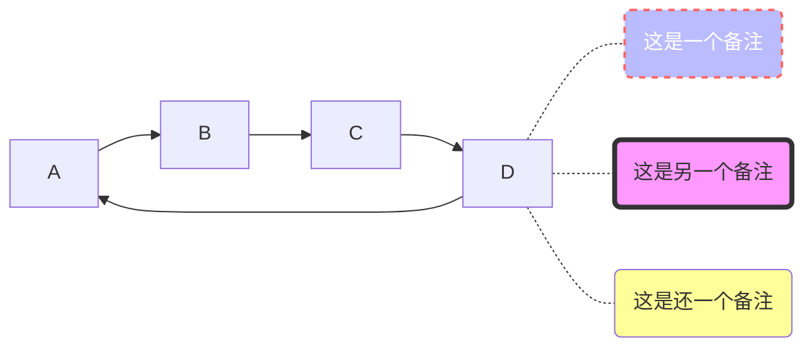
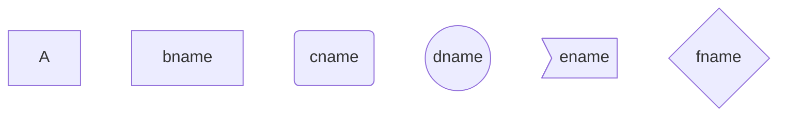
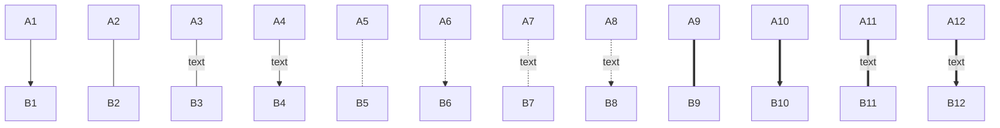
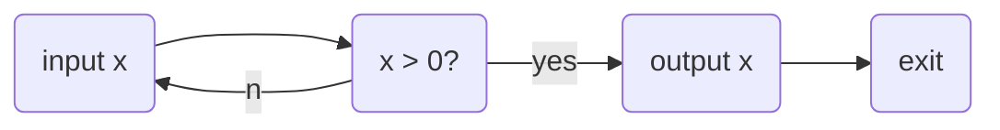

# 学习Markdown语法
●♦►■
## 行首缩进
&emsp;&emsp;全角段首两空格缩进 
&ensp;&ensp;半角段首两空格缩进 

## 字体
**这是加粗的文字**
*这是倾斜的文字*` 或  _斜体_
***这是斜体加粗的文字***
~~这是加删除线的文字~~
<u>下划线</u> （尽量不要给文本加下划线，因为这会和超链的表现形式混淆，会被误以为是个超链。）

> 这是引用的内容
> > 这是引用的内容
> >
> > >>>>>>>> 这是引用的内容

分割线示例：
---
***

Markdown中如何插入尖括号
此时我们需要使用转义字符：&lt;&gt;
比如：&lt;尖括号中的内容&gt;

## 导出PDF时的分页符

~~~html

~~~

## 插入链接
[谷歌搜索](https://www.google.com)

## 插入图片

## 图片对齐

## 图片尺寸

## 字体、字号与颜色
color=red
我是黑体字
我是微软雅黑
我是华文彩云
color=#0099ff size=72 face="黑体"
color=#00ffff
color=gray

<table><tr><td bgcolor=orange> 背景色是 1 orange</td></tr></table>

我是内容

## 画图
参考：

https://blog.csdn.net/whatday/article/details/88655461

https://mermaid-js.github.io/mermaid/#/

图方向
TB，从上到下
TD，从上到下
BT，从下到上
RL，从右到左
LR，从左到右

节点形状
默认节点 A
文本节点 B[bname]
圆角节点 C(cname)
圆形节点 D((dname))
非对称节点 E>ename]
菱形节点 F{fname}

连线

