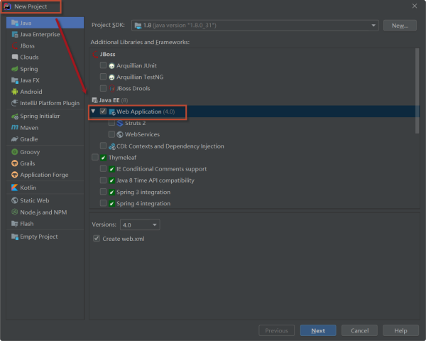
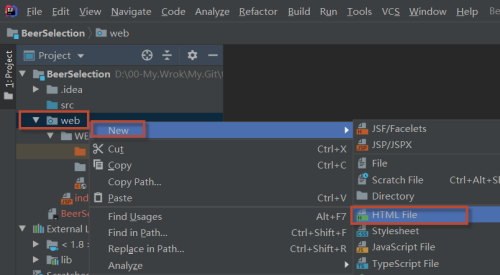
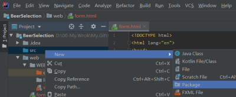
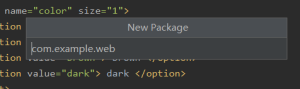
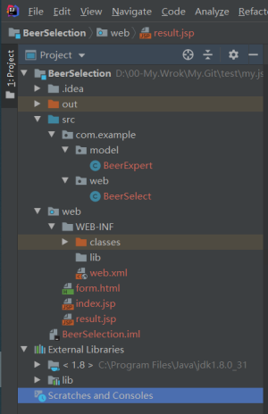
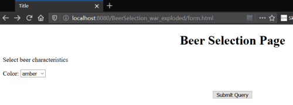
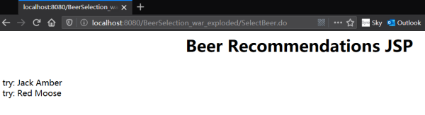

## 实例2：Beer Selection Page（HF's Charpter 3）

本例子是《Head.First.Servlets.&.JSP（2e）》中第三章中的。

这次只建一个Project，就在这个Project中进行工作，不再另建一个Module


然后参考上个例子按步骤进行：

1. 在路径`BeerSelection\web\WEB-INF`下新建文件夹`classes`和`lib`，并完成`Project Structure`中的路径设置

2. 设置Tomcat容器

3. 导入Tomcat中的lib文件夹

然后在`BeerSelection\web`路径下新建文件`form.html`


源码：form.html

```html
<!DOCTYPE html>
<html lang="en">
    <head>
        <meta charset="UTF-8">
        <title>Title</title>
    </head>

    <body>
        <h1 align="center">Beer Selection Page</h1>

        <form method="POST"
              action="SelectBeer.do">
            Select beer characteristics<p>
            Color:
            <select name="color" size="1">
                <option value="light"> light </option>
                <option value="amber"> amber </option>
                <option value="brown"> brown </option>
                <option value="dark"> dark </option>
            </select>
            <br><br>

            <div style="text-align: center;">
                <input type="SUBMIT">
            </div>

        </form>
    </body>
</html>
```

在`BeerSelection\web`路径下新建文件`result.jsp`

源码：result.jsp

```jsp
<%--
  Created by IntelliJ IDEA.
  User: Administrator
  Date: 2020/2/15
  Time: 17:48
  To change this template use File | Settings | File Templates.
--%>
<%@ page contentType="text/html;charset=UTF-8" language="java" %>
<%@ page import="java.util.*" %>

<html>
	<body>
	<h1 align="center">Beer Recommendations JSP</h1>
	<p>
	<%
	List styles = (List)request.getAttribute("styles");
	Iterator it = styles.iterator();
	while(it.hasNext()) {
		out.print("<br>try: " + it.next());
	}
	%>

	</body>
</html>
```

编辑文件`BeerSelection\web\WEB-INF\web.xml`

```xml
<?xml version="1.0" encoding="UTF-8"?>
<web-app xmlns="http://xmlns.jcp.org/xml/ns/javaee"
         xmlns:xsi="http://www.w3.org/2001/XMLSchema-instance"
         xsi:schemaLocation="http://xmlns.jcp.org/xml/ns/javaee http://xmlns.jcp.org/xml/ns/javaee/web-app_4_0.xsd"
         version="4.0">

	<servlet>
		<servlet-name>Ch3 Beer</servlet-name>
		<servlet-class>com.example.web.BeerSelect</servlet-class>
	</servlet>

	<servlet-mapping>
		<servlet-name>Ch3 Beer</servlet-name>
		<url-pattern>/SelectBeer.do</url-pattern>
	</servlet-mapping>


</web-app>
```

在`BeerSelection\src`下新建包：`com.example.web`和`com.example.model`

.


在`BeerSelection\src\com\example\web`文件夹下新建Java文件`BeerSelect.java`

在`BeerSelection\src\com\example\model`文件夹下新建Java文件`BeerExpert.java`

源码：BeerSelect.java

```java
package com.example.web;

import com.example.model.*;
import javax.servlet.*;
import javax.servlet.http.*;
import java.io.*;
import java.util.*;

public class BeerSelect extends HttpServlet {

	public void doPost(HttpServletRequest request,
					   HttpServletResponse response)
			throws IOException, ServletException {

		String c = request.getParameter("color");
		BeerExpert be = new BeerExpert();
		List result = be.getBrands(c);

		// V3版删除
//		response.setContentType("text/html");
//		PrintWriter out = response.getWriter();
//		out.println("Beer Selection Advice<br>");

		request.setAttribute("styles", result);

		RequestDispatcher view =
				request.getRequestDispatcher("result.jsp");

		view.forward(request, response);

		// V3版删除
//		Iterator it = result.iterator();
//		while(it.hasNext()) {
//			out.print("<br>try: " + it.next());
//		}
	}
}
```

源码：BeerExpert.java

```java
package com.example.model;
import java.util.*;

public class BeerExpert {
	public List getBrands(String color) {
		List brands = new ArrayList();
		if (color.equals("amber")) {
			brands.add("Jack Amber");
			brands.add("Red Moose");
		}
		else {
			brands.add("Jail Pale Ale");
			brands.add("Gout Stout");
		}

		return(brands);
	}
}
```

最终的目录结构是这样的


最后编译运行，在地址栏输入地址：http://localhost:8080/BeerSelection_war_exploded/form.html

